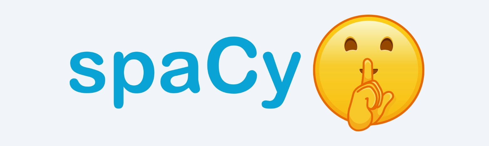

# spaCy Whisper




spaCy Whisper is a Python package designed to integrate Whisper transcriptions with the natural language processing (NLP) capabilities of spaCy. It allows users to process and analyze Whisper transcribed text with the powerful tools offered by spaCy, including tokenization, entity recognition, part-of-speech tagging, and more.

## Features

- **Word Level Processing:** Assigns custom attributes such as start and end times, and probabilities to tokens based on Whisper output.
- **Segment Level Processing:** Processes text at a segment level where each word in a segment shares the same start and end time.
- **Custom Token Extensions:** Adds custom extensions like start_time, end_time, and probability to spaCy's Token objects.
- **Custom Span Extensions:** Adds start_time and end_time extensions to Span objects (such as entities and sentences).
- **Custom Document Extensions:** Adds a timestamp_doc extension to Doc objects, representing the document with timestamps.

## Installation

spaCy Whisper can be installed via pip:

```bash
pip install spacy-whisper
```

## Usage

```python
from spacy_whisper import SpacyWhisper
import json

# Load a Whisper Output:
with open("whisper_output.json", "r", encoding="utf-8") as f:
    whisper_output = json.load(f)

# Initialize SpacyWhisper
sw = SpacyWhisper(lang="en", model="en_core_web_sm", segments_key="segments", word_level=True)

doc = sw.create_doc(whisper_output)

# Access custom attributes
for token in doc:
    print(token.text, token._.start_time, token._.end_time, token._.probability)
```

### Expected Output

```markdown
[00:00:00.000] One of the most useful things you can learn as an intermediate Python student is comprehension.
[00:00:04.720] List comprehension looks something like this.
[00:00:07.000] Imagine we had a list of names, Tom, Cat, and Bob.
```

## Identify Entity Timing

```python
for ent in doc.ents:
    if ent.label_ == "PERSON":
        print(ent, ent.label_, ent._.start_time, ent._.end_time)
```

### Expected Output

```markdown
Tom PERSON 8.4 8.66
Bob PERSON 9.24 9.54
Tom PERSON 24.64 24.94
Bob PERSON 24.94 25.2
N. PERSON 50.94 51.82
```

## Find when Sentences Start and End

```python
for sent in doc.sents:
    print(sent.text, sent._.start_time, sent._.end_time)
```

### Expected Output

```markdown
One of the most useful things you can learn as an intermediate Python student is comprehension. 0.0 4.04
List comprehension looks something like this. 4.72 6.68
Imagine we had a list of names, Tom, Cat, and Bob. 7.0 9.54
...
```